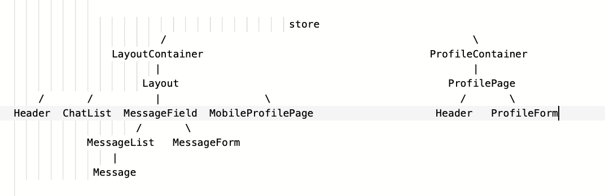
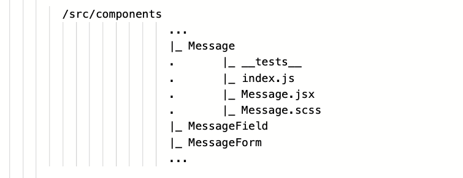

# Messenger

[](https://codeclimate.com/github/youngandinnocent/messenger/maintainability)
[](https://codeclimate.com/github/youngandinnocent/messenger/test_coverage)
[](https://travis-ci.org/youngandinnocent/messenger)

Instant messaging app

# Used by

* [Webpack]
* [Babel]
* [React]
* [Redux]
* ... and other awesome projects

# Guides

* [Введение](#intro)
* [Установка](#setting)
* [Описание проекта](#description)
* [Настройка среды разработки](#environment)
    * [Webpack](#webpack)
    * [Babel](#babel)
* [Приложение](#app)
    * [Архитектура](#architecture)
    * [Контейнеры](#containers)
    * [Компоненты](#components)
    * [npm-модули](#npmmodules)
* [Линтинг и форматирование кода](#lint)
* [Тестирование](#test)
* [Progressive Web App](#pwa)

# <a name="intro"></a>Введение

Messenger — приложение для обмена мгновенными сообщениями

### Видеообзор
Кликните на изображение ниже для воспроизведения видео

[](https://www.youtube.com/watch?v=9_o9vU3l5CA)

### Необходимые инструменты разработки
* [Node.js] - среда разработки приложения, исполняющая JS
* Инструменты для сборки проекта:
    * менеджер пакетов [npm] (или [Yarn])
    * сборщик модулей Webpack - для написания модульного кода
    * компилятор Babel - чтобы писать современный код, который будет работать и в старых браузерах

# <a name="setting"></a>Установка
Склонируйте репозиторий на локальный компьютер:
```sh
$ git clone https://github.com/youngandinnocent/messenger.git
```
Разверните среду разработки проекта (установить все зависимости):
```sh
$ npm i
```
Запустите режим сборки:
```sh
// стандартная разработка
$ npm run dev

// разработка livereload
$ npm run dev-s

// продакшен
$ npm run build
```

# <a name="description"></a>Описание проекта
Тип приложения: система мгновенного обмена сообщениями, мессенджер

Технологии: React-Redux, SPA, PWA

Принцип работы приложения:
* index.html - оболочка для всех страниц
* при первом входе приложение подгружается
* работает в браузере пользователя как клиент, который отрисовывает все страницы и изменения, не ходя за версткой на сервер
* заимодействует с сервером по API, получая данные в JSON
* может работать без подключения к сети (offline first)
* отправляет push-уведомления

Принципы проектирования:
* организация файловой структуры проекта по функциональности и методологии Atomic Design
* декларативный код
* flux-архитектура разделения логики, данных и пользовательского интерфейса
* однонаправленный поток данных
* глобальное хранилище на верхнем уровне с доступом к состоянию для компонентов (Redux)
* принцип единственной ответственности (SRP) при разработке компонентов
* паттерн Container/Component в разделении ответственности между разными компонентами
* stateless-компонент должен быть чистой функцией
* типобезопасность данных через использование propTypes
* модульное тестирование
* отладка с React DevTools и Redux DevTools

# <a name="environment"></a>Настройка среды разработки
npm-модули, предназначенные для инструментов разработки, установлены в зависимости разработки (`devDependencies`)

### <a name="webpack"></a>Webpack
Сборщик модулей Webpack - инструмент, позволяющий скомпилировать JavaScript-модули в единый JS-файл:
* собрать воедино ресурсы (согласно импортам)
* транспилировать JS нового поколения в JS старого поколения (babel)
* запустить webpack-dev-server (в нём встроен локальный сервер) для разработки в режиме livereload (“живая перезагрузка браузера”))
* выполнить Tree Shaking - метод оптимизации библиотек путем удаления кода из окончательного файла, который фактически не используется

npm-модули для работы с webpack:
* `webpack` - сам бандлер
* `webpack-cli` - набор команд для конфигурации webpack по нужным сценариям исполнения
* `webpack-dev-server` - встроенный локальный сервер для разработки в режиме livereload

Режимы сборки (заданы через скрипты в package.json):
* `webpack --mode development` - стандартная разработка (порт 8080)
* `webpack-dev-server --mode development --port 3000` - разработка в режиме livereload (порт 3000)
* `webpack --mode production` - режим продакшен

Настройка webpack выполнена в файле [webpack.config.js](webpack.config.js) в корне проекта:
* Точка входа [./src/index.js](src/index.js) - путь к файлу, с которого начинается сборка проекта
* Вывод ./dist/bundle.js - путь к файлу, в который собирается проект
* Загрузчики модулей - инструменты webpack, которые определенным образом преобразуют исходный код модулей:
    * для скриптов:
        * babel-loader позволяет webpack транспилировать новый код js и jsx-файлов в старый эквивалент
    * npm-модули:
        * `babel-loader`

    * для стилей:
        * sass-loader загружает scss-файлы и компилирует их в CSS
        * css-loader интерпретирует директиву import 'style.css' в CSS
        * MiniCssExtractPlugin.loader минифицирует файл
        * style-loader внедряет итоговый CSS в DOM, используя тег `<style>`
    * npm-модули:
        * `css-loader`
        * `mini-css-extract-plugin`
        * `sass-loader`
        * `style-loader`

* Плагины - программные модули, расширяющие возможности webpack:
    * HTMLWebpackPlugin - автоматически создает HTML-файл с подключенным js-скриптом
        * npm-модули:
            * `html-webpack-plugin`
    
    * MiniCssExtractPlugin - сжимает CSS-файлы
        * npm-модули:
            * `mini-css-extract-plugin`

    * CopyWebpackPlugin - копирует файлы и директории в сборку
        * npm-модули:
            * `copy-webpack-plugin`

* devtool - свойство, которое управляет генерацией source map (содержит информацию о том, как транспилировать код обратно в исходный):
    * `eval-source-map` - одна из лучших опций для разработки: первоначально медленный, но обеспечивает быструю скорость восстановления и возвращает исходный код.

* devServer - свойство, которое регулирует поведение встроенного сервера
    * `historyApiFallback: true` - сервер отвечает главной страницей на все запросы по незнакомым URL

### <a name="babel"></a>Babel
Babel - транспилятор кода стандарта ES6+ в понятный браузерам и средам стандарт.

npm-модули для работы с babel:
* @babel/core - сам транспилятор
* @babel/preset-env - группа плагинов, реализующих стандартизированные возможности js и позволяющих использовать новейший стандарт языка
* @babel/preset-react - преобразование JSX в JS
* babel-loader - настройка для работы в webpack
* @babel/plugin-transform-runtime - оптимизирует сборку и создает изолированную среду для кода проекта
* @babel/plugin-proposal-class-properties - позволяет преобразовывать свойства статического класса, а также использовать синтаксис инициализатора свойств
* babel-jest - для использования в jest

# <a name="app"></a>Приложение
### <a name="architecture"></a>Архитектура
### Файлововая структура
В корне проекта / располагаются все конфиги, связанные с разработкой и сборкой приложения:
* [package.json](package.json) - информация о приложении и зависимостях
* [webpack.config.js](webpack.config.js) - настройки webpack
* [.babelrc](.babelrc) - настройки пресетов и плагинов babel
* [.editorconfig](.editorconfig) - единые настройки для разных редакторов кода и IDE
* [.eslintrc](.eslintrc) - настройки eslint (анализатор кода на ошибки в стандартах написания)
* [.prettierrc](.prettierrc) - правила для prettier (инструмент автоматического форматирования кода)
    
Также в корне расположены директории:
* [dist](dist) - каталог, в который собирается проект
* [coverage](coverage) и [jest](jest) - настройки jest (фреймворк для тестирования) и параметры покрытия кода приложения тестами
* [api](api) - данные для получения (имитация данных с сервера)
* [src](src) - директория с исходным кодом приложения

src
* Точка входа проекта - [/src/index.js](src/index.js), оболочка для всех страниц - [/src/index.html](src/index.html)

* Здесь же определены:
    * [store.js](/src/store.js) - единое хранилище всего состояния приложения
    * [actions](/src/actions) - структуры, отправляющие данные с намерением изменить состояние в хранилище
    * [reducers](/src/reducers) - функции, которые обрабатывают данные от actions и изменяют состояние хранилища
    * [middlewares](/src/middlewares) - программы, усиливающие и расширяющие функционал приложения, перехватывают данные от actions -> вносят нужные изменения -> модифицированные данные попадают в редуктор, который меняет хранилище

    * [components](/src/components) - компоненты приложения, не подключенные к хранилищу, преимущественно отвечающие за пользовательский интерфейс
    * [containers](/src/containers) - компоненты, которые подключены к хранилищу и отвечают за бизнес-логику

    * [routes.js](/src/routes.js) - роутинг, обеспечивающий маршрутизацию по страницам приложения

    * [sw.js](/src/sw.js) - service worker - основа PWA (прогрессивное web-приложение), посредник между клиентом и сервером, отправляющий нужные данные в качестве ответа
    * [manifest.json](/src/manifest.json) - часть технологии PWA, предоставляет клиенту информацию о приложении
    * [assets](/src/assets) - набор иконок для PWA

### Архитектура приложения
Архитектура приложения обусловлена однонаправленным потоком данных React, что затрудняет взаимодействие компонентов, не связанных отношениями родителя и потомка.
В качестве решения используется паттерн Flux и реализация технологии, основанной на нем - Redux.
Таким образом, архитектура приложения представляет из себя:
* единоe глобальноe хранилищe **store**, к которому подключены
* суперкомпоненты, называемые **containers**, способные посылать запросы на изменение данных в хранилище и регулирующие эти допуски для компонентов
* дерево компонентов - **компоненты**, которые реализуют пользовательский интерфейс приложения


### Хранилище
Глобальное хранилище включает три логических раздела, каждому из которых назначены соответствующие редукторы, объединенные в один объект в точке входа в редукторы:
```sh
// файл /reducers/index.js

...
router: connectRouter(history) // редуктор роутинга для работы Redux в React Router, принимает объект history, который хранит путь к текущему location
chats: chatsReducers // редуктор чатов
profile: profileReducers // редуктор профиля
```

Каждый редуктор передает соответствующий раздел общего состояния. Состояние, возвращенное редуктором, попадет в его раздел.
Согласно документации Redux, во избежание появления ошибок объект состояния должен быть иммутабельным.
Для этого в имплементации редукторов используется оператор расширения (...) и библиотека react-addons-update, которая упрощает поддержку неизменяемости данных без существенной переработки этих данных:
```sh
// файл /reducers/chats.js

import update from 'react-addons-update';
import {
// other actions
CHATS_DELETE,
} from 'actions/chats';

const initialState = {
    // some state
};

export default (state = initialState, action) => {
    switch (action.type) {
        // other cases
        case CHATS_DELETE:
        return update(state, {
            $merge: { // команда библиотеки react-addons-update, возвращающая новый объект,
                            полученный из соединения предыдущего и заданного
            entries: { ...action.payload.newState },
            },
        });
    }
};
```

### Контейнеры
Контейнеры подключены к хранилищу с помощью модуля react-redux, функцией `connect()`.
`connect()` связывает данные из контейнера со свойствами конкретного компонента.
Принимает два аргумента:
* `mapStateToProps` - функция, которая возвращает объект, свойства которого станут свойствами контейнера. Принимает состояние, от которого и берутся свойства возвращаемого объекта.
* `mapDispatchToProps` - функция, которая возвращает объект с actions. Также станет свойством контейнера. Тут же вызывается анонимная функция, которой передается компонент LayoutContainer.
```sh
// файл /containers/LayoutContainer.jsx

...
export const LayoutRedux = connect(mapStateToProps, mapDispatchToProps)(LayoutContainer);
```

Хранилище имеет API для изменения состояния приложением - `store.dispatch(action)`.
Метод `dispatch()` передает `action` в Redux. `action` содержит тип действия и может содержать данные,
которые используются для обновления состояния:
```sh
// файл /src/actions/chats.js

...
export const chatsDelete = (newState) => ({
    type: CHATS_DELETE,
    payload: newState,
});
```

Для работы технологии react-redux приложение в точке входа оборачивается в компонент `<Provider />`:
```sh
// файл /src/index.js
...
ReactDom.render(
    <Provider store={store}>
        // React Router
    </Provider>,
    document.getElementById('root'),
);
```
### Компоненты
Структура дерева компонентов организована по функциональности с применением методологии atomic design.
Компоненты сгруппированы в каталоги по назначению с одноименным названием, в которых находятся файлы исходного кода компонента, стили и тесты, имеющие доменные имена как у родительских каталогов:


Для удобства импорта компонентов предназначена точка входа в компонент - **/ConponentName/index.js**,
который реэкспортирует модуль компонента, а Webpack по умолчанию находит его и согласно импортам
собирает весь компонент:
```sh
// файл /**/**/Message/index.js

export * from './Message';
```

Компонент описан в jsx-файле, в который импортированы модули React, прочие служебные библиотеки,
стили и другие компоненты (если у компонента есть потомки):
```sh
// файл /**/**/Message/Message.jsx

import React from 'react';
import PropTypes from 'prop-types';
import className from 'classnames';

import './Message.scss';

export function Message(props) {
    // some code
};
```

Стили компонента заданы в `css/scss-файле`.
Тесты располагаются в каталоге `__tests__`.

### <a name="containers"></a>Контейнеры
**/src/containers**

Контейнеры представляют из себя компоненты, которые, в отличие от обычных, подключены к Redux, и поэтому могут посылать запросы к глобальному хранилищу на изменение данных.
Это возможно благодаря механизму `dispatch(actions)` -> `reducer` -> `store`:
`action` направляется в хранилище с помощью метода `dispatch()` -> проходит через свой `reducer` -> `reducer` меняет `store` в своей части

Контейнеры реализуют две линии поведения приложения:
* **LayoutContainer** - функционал, отвечающий за работу чатов и их составляющих
* **ProfileContainer** - функционал страницы профиля (редактирование имени и описания профиля)

Контейнеры предоставляют компонентам API для запросов на изменение данных в глобальном хранилище,
и пробрасывают им пропсы с данными, на которые компоненты подписаны. Когда данные в хранилище меняются, компоненты автоматически обновляются.

### API контейнеров
* Общие методы:
    * `handleNavigate(link)` - навигация по страницам приложения
* LayoutContainer:
    * `handleMessageSend(messageObj)` - отправить сообщение в чат
    * `handleChatAdd(chatObj)` - добавить новый чат
    * `handleChatDelete(chatId)` - удалить чат

* ProfileContainer:
    * `handleForm(formObj)` - редактировать название и описание профиля

Для демонстрации поливариантности React контейнер **LayoutContainer** реализован на классах, а контейнер **ProfileContainer** - на хуках.

### <a name="components"></a>Компоненты
**/src/components**

Компоненты выполняют функцию представления элементов пользовательского интерфейса. А также могут
реализовывать локальную бизнес-логику на уровне компонента.
Компоненты без состояния описываются чистыми функциями, компоненты с состоянием - классами.
Часть элементов, из которых состоят компоненты (кнопки, иконки), импортируются из библиотеки `@material-ui`

Каждый компонент, помимо данных от родителей, может получать данные из хранилища через **props**, но не каждый может иметь право на запрос для изменения этих данных в хранилище.
Если у компонента есть допуск от контейнера (предоставлено API) на изменение данных, компонент:
* вызывает соответствующий метод и передает в него нужные данные
* метод отрабатывает в компоненте с нужными данными благодаря замыканию
* вызывается соответствующий для данного метода `action` и направляется в хранилище через `dispatch()`
* прежде чем попасть в `reducer`, каждый вызванный `action` проходит через цепочку `middlewares` (при наличии)
* далее `action` проходит через соответствующий `reducer`
* `reducer` вносит изменения в свою часть хранилища
* компоненты, подписанные на данные изменения в хранилище, обновляют свои состояния

### <a name="npmmodules"></a>npm-модули
**npm-модули React**
* `react` - библиотека React
* `react-dom` - билиотека для работы React с DOM
* `prop-types` - проверка и кастомизация по умолчанию типов пропсов
* `react-addons-update` - библиотека для иммутабельности данных
* `react-router-dom` - библиотека для роутинга в браузере

**npm-модули Redux**
* `redux` - библиотека Redux
* `react-redux` - библиотека для работы Redux в React
* `connected-react-router` - привязывает Redux к React Router
* `redux-actions` - набор хелперов для работы с экшенами
* `redux-thunk` - middleware библиотека для асинхронных экшенов в Redux
* `redux-persist` - сохранение и восстановление состояния хранилища
* `redux-devtools-extension` - инструмент отладки изменений состояния приложения

**прочие вспомогательные библиотеки**
* `history` - библиотека для навигации по истории сеансов
* `classnames` - библиотека для удобства работы с классами элементов
* `@material-ui/core` - библиотека React-компонентов

# <a name="lint"></a>Линтинг и форматирование кода
Анализатором кода на ошибки в стандартах написания и паттернах проектирования (линтинг) служит [ESLint](https://eslint.org).
* База стиля - **Airbnb JavaScript Style Guide**.
* Настройки и правила заданы в [.eslintrc](.eslintrc) в корне проекта. Файлы и папки, которые не должны обрабатываться ESlint, заданы в [.eslintignore](.eslintignore).
* Скрипт для выполнения ESlint: `eslint --debug src` - линтер просмотрит все файлы в директории src и выведет подробный отчёт по файлам, в которых нашёл ошибки

* **npm-модули:**
    * `eslint` - библиотека ESLint
    * `babel-eslint` - позволяет ESLint работать с исходным кодом, преобразованным Babel
    * `eslint-plugin-babel` - плагин, дополняющий `babel-eslint`, в нём переделаны правила, которые вызывают проблемы при обработке экспериментальных возможностей
    * `eslint-config-airbnb` - предоставляет правила Airbnb в виде конфигурации, которую можно модифицировать
    * `eslint-plugin-import` - поддерживает линтинг синтаксических конструкций `import/export`
    * `eslint-plugin-react` - содержит ESLint-правила, рассчитанные на React
    * `eslint-plugin-jsx-a11y` - доступность JSX-элементов для людей с ограниченными возможностями
    * `eslint-plugin-jest` - ESlint-плагин для работы с Jest
    * `eslint-config-jest-enzyme` - когда переменные React и Enzyme оказываются глобальными, ESLint не будет выдавать предупреждения

Автоматическое форматирование кода обеспечивается средством [Prettier](https://prettier.io), которое нацелено на использование жёстко заданных правил по оформлению программ.
* Конфигурация работы инструмента описана в [.prettierrc](.prettierrc) в корне проекта.
* Скрипт для выполнения Prettier: `prettier --write src` - Prettier находит все файлы в папке src и форматирует их согласно правилам.

* npm-модули:
    * `prettier` - библиотека Prettier
    * `eslint-plugin-prettier` - Prettier форматирует код с учётом правил ESLint

Инструмент управления Git hooks - возможность выполнять определенные действия перед выполнением коммита или перед отправкой кода в репозиторий - [Husky](https://github.com/typicode/husky).
И линтер индексированных файлов - [Lint-staged](https://github.com/okonet/lint-staged) - помогает предотвратить отправку в репозиторий кода с ошибками
* Конфигурация работы инструментов описана в [package.json](package.json).
* Перед коммитом в Git выполняется Husky, который запускает скрипт lint-staged, который для файлов js и jsx запускает набор команд:
    * `npm run prettier && npm run eslint && npm run test` - отформатировать код, проверить линтером и запустить тесты
    * `git add` - и, при успешном выполнении предыдущей команды, добавляет в индекс

* npm-модули:
    * `husky` - библиотека Husky
    * `lint-staged` - библиотека lint-staged

Для поддержки согласованного стиля кодирования в мультиплатформенных командах настроен конфигурационный файл [EditorConfig](.editorconfig) в корне проекта.

# <a name="test"></a>Тестирование

# <a name="pwa"></a>Progressive Web App


[Webpack]: <https://webpack.js.org>
[Babel]: <https://babeljs.io>
[React]: <https://reactjs.org>
[Redux]: <https://redux.js.org>
[Node.js]: <https://nodejs.org/en/>
[npm]: <https://www.npmjs.com>
[Yarn]: <https://yarnpkg.com>